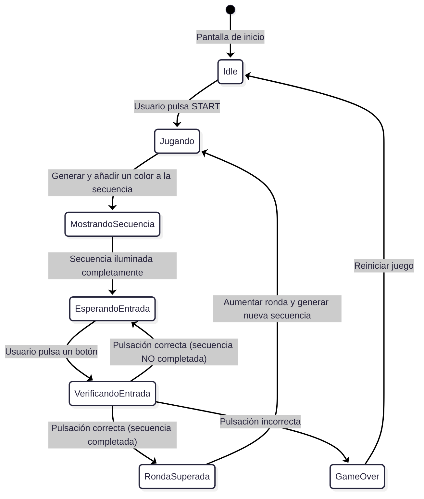
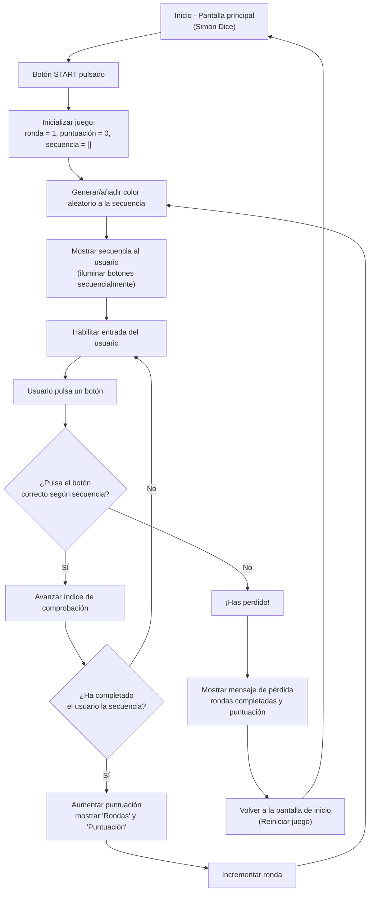

# SIMÓN DICE - PMDM 🦑🫧🪼


## DESCRIPCIÓN DEL PROYECTO 👀

- ***ESTE PROYECTO ES UNA IMPLEMENTACIÓN DEL JUEGO "SIMÓN DICE" PARA ANDROID, DESARROLLADO EN KOTLIN CON ARQUITECTURA MVVM. EL JUEGO CONSISTE EN MEMORIZAR Y REPETIR SECUENCIAS DE COLORES QUE SE VAN HACIENDO CADA VEZ MÁS LARGAS Y COMPLEJAS.***

> [!NOTE]
> **Antes de empezar a codificar el programa he realizado un diagrama de flujo y estado para comprender de manera profunda la lógica que va a seguir🤖...**

---

- **DIAGRAMA DE ESTADO 🎀**



---

- **DIAGRAMA DE FLUJO 🎳**



<br>

---

## ESTRUCTURA DEL PROYECTO 🏗️

> [!WARNING]
> ***LOS TESTS UNITARIOS ESTÁN EN `SIMON_DICE_SAUL\app\src\test\java\com\example\simon_dice_saul\presentation\viewmodel\ModeloVistaSimonTest.kt`***


### MODEL (MODELO DE DATOS Y DOMINIO) 🦕
- **ColorSimon: ENUM QUE REPRESENTA LOS COLORES DEL JUEGO**
  
```kotlin
// FASES DEL JUEGO
enum class EstadoJuego {
    INICIO, JUGANDO, MOSTRANDO_SECUENCIA, ESPERANDO_ENTRADA, 
    VERIFICANDO_ENTRADA, RONDA_SUPERADA, JUEGO_TERMINADO
}

// ENUM QUE REPRESENTA LOS 4 COLORES DEL JUEGO CON IDENTIFICADORES ÚNICOS
enum class ColorSimon(val identificador: Int) {
    ROJO(0), VERDE(1), AZUL(2), AMARILLO(3)
}
```

- **MotorJuegoSimon: CLASE QUE CONTIENE TODA LA LÓGICA DEL JUEGO, GESTIÓN DE SECUENCIAS, PUNTUACIÓN Y ESTADOS DEL JUEGO**
  
```kotlin
// CLASE QUE CONTIENE TODA LA LÓGICA DEL JUEGO
class MotorJuegoSimon {
    // MÉTODOS:
    // - iniciarPartida(): Reinicia el juego al estado inicial
    // - anadirColorAleatorio(): Añade nuevo color a la secuencia
    // - validarEntradaUsuario(): Comprueba si el input es correcto
    // - obtenerEstadoActual(): Devuelve estado inmutable del juego
}
```

---

### VIEW (INTERFAZ DE USUARIO) 🤹 

- **SimonDiceScreen: PANTALLA PRINCIPAL CON JETPACK COMPOSE**
- **INTERFAZ QUE OBSERVA LOS CAMBIOS DE ESTADO**
- **BOTONES DE COLORES Y ANIMACIONES**

```kotlin
@Composable
fun SimonDiceScreen(viewModel: ModeloVistaSimon) {
    // OBSERVA EL ESTADO DEL VIEWMODEL
    val uiState = viewModel.uiState.collectAsState().value
    
    // USA LaunchedEffect PARA EVENTOS DE UN SOLO USO ( PARA AÑADIR LAUNCHEFFECT AL PROYECTO PUSE UN PRINTLN COMO SI FUESE UN SONIDO DE ERROR ) 
    LaunchedEffect(viewModel.eventEffect) {
    }
    
    // COMPOSICIÓN DE UI CON COMPONENTES REUTILIZABLES
    Column {
        // Header con título y puntuación
        // Mensaje de estado del juego ( EL CUAL CONTIENE UNA ANIMACIÓN DE FLUIDEZ ( CAMBIA DE MANERA FLUIDA ENTRE "JUEGO TERMINADO", "OBSERVA LA SECUENCIA" Y "TU TURNO" )) 
        // Botones de control (Iniciar/Reiniciar)
        // Grid de colores con animaciones ( EFECTO REBOTE O ZOOM CUANDO SE MUESTRA LA SECUENCIA EN CADA BOTÓN )
    }
}
```


---

### VIEWMODEL (GESTIÓN DE ESTADO) 🦫 

- **ModeloVistaSimon: GESTIONA EL ESTADO DE LA UI Y COORDINA CON EL MOTOR DE JUEGO**
- **USO DE StateFlow PARA EL MANEJO DE ESTADOS**
- **MANEJO DE CORRUTINAS PARA ANIMACIONES Y LÓGICA**
  
```kotlin
class ModeloVistaSimon : ViewModel() {
    // ESTADO REACTIVO CON StateFlow
    private val _uiState = MutableStateFlow(UiState())
    val uiState: StateFlow<UiState> = _uiState.asStateFlow()
    
    // GESTIÓN DE EVENTOS DE UN SOLO USO
    private val _eventEffect = MutableStateFlow<EventEffect?>(null)
    val eventEffect: EventEffect? get() = _eventEffect.value
    
    // SEALED CLASS PARA ESTADOS DEL JUEGO
    sealed class GameState {
        object INICIO : GameState()
        object MOSTRANDO_SECUENCIA : GameState()
        object ESPERANDO_ENTRADA : GameState()
        object RONDA_SUPERADA : GameState()
        object ERROR : GameState()
    }
    
    // FUNCIONES:
    // - iniciarPartida(): Inicia nueva partida
    // - alPulsarColor(): Maneja input del usuario
    // - reiniciarJuego(): Reinicia desde pantalla de error
}
```

<br>

### COMO SE VE EL PROGRAMA AL EJECUTAR 👀

> [!NOTE]
> **AL SER CAPTURAS NO SE APRECIA EL EFECTO DE FLUIDEZ QUE AÑADÍ PARA LAS TRANSICCIONES DE TEXTO, SI SE EJECUTASE EL PROGRAMA, SE PODRÍA APRECIAR COMO "TU TURNO", "JUEGO TERMINADO", "OBSERVA LA SECUENCIA" SE INTERCAMBIAN EN EL MISMO LAYOUT CON UN EFECTO FLUIDO ( COMO DE MÁQUINA DE ESCRIBIR )**

---

> [!WARNING]
> **COMO SE VE LA INTERFAZ UNA VEZ ARRANCAS EL PROGRAMA**


> [!WARNING]
> **COMO SE VE LA INTERFAZ MIENTRAS OBSERVAS LA SECUENCIA**


> [!WARNING]
> **COMO SE VE LA INTERFAZ UNA VEZ CLICAS INICIAR**


> [!WARNING]
> **COMO SE VE LA INTERFAZ UNA VEZ FALLAS LA SECUENCIA**


### IMPLEMENTACIÓN ROOM 🦜

> ***Se migró el almacenamiento del récord desde SharedPreferences a una base de datos local con Room, manteniendo la funcionalidad y la experiencia de usuario.***

- Misma lógica de juego
- UI sin cambios
- Persistencia más robusta y escalable

> ***Se implmenetaron dependencias de ROOM ( room-runtime, room-compiler ), clase Record como @Entity, DAO del record para operaciones básicas ( get, insert, clear ), base de datos AppDatabase ( singleton implícito ), integración directa en ModeloVistaSimón y verificación en MainActivity***

```kotlin
package com.example.simon_dice_saul.data.dao

import androidx.room.Dao
import androidx.room.Insert
import androidx.room.OnConflictStrategy
import androidx.room.Query
import com.example.simon_dice_saul.data.model.Record

@Dao
interface RecordDao {

    @Query("SELECT * FROM record_table WHERE id = 0")
    fun getRecord(): Record?

    @Insert(onConflict = OnConflictStrategy.REPLACE)
    fun insertRecord(record: Record)

    @Query("DELETE FROM record_table")
    fun clearRecord()
}
```

---

```kotlin
package com.example.simon_dice_saul.data.database

import androidx.room.Database
import androidx.room.RoomDatabase
import com.example.simon_dice_saul.data.dao.RecordDao
import com.example.simon_dice_saul.data.model.Record

@Database(
    entities = [Record::class],
    version = 1,
    exportSchema = false
)
abstract class AppDatabase : RoomDatabase() {
    abstract fun recordDao(): RecordDao
}
```

---

```kotlin
package com.example.simon_dice_saul

import android.os.Bundle
import androidx.activity.ComponentActivity
import androidx.activity.compose.setContent
import androidx.compose.foundation.layout.fillMaxSize
import androidx.compose.material3.MaterialTheme
import androidx.compose.material3.Surface
import androidx.compose.ui.Modifier
import androidx.lifecycle.viewmodel.compose.viewModel
import androidx.room.Room
import com.example.simon_dice_saul.data.database.AppDatabase
import com.example.simon_dice_saul.data.model.Record
import com.example.simon_dice_saul.presentation.ui.SimonDiceScreen
import com.example.simon_dice_saul.presentation.viewmodel.ModeloVistaSimon
import com.example.simon_dice_saul.ui.theme.SIMON_DICE_SAULTheme
import java.text.SimpleDateFormat
import java.util.*

class MainActivity : ComponentActivity() {

    override fun onCreate(savedInstanceState: Bundle?) {
        super.onCreate(savedInstanceState)

        // Opcional: prueba inicial de Room (puedes borrar este bloque si no lo necesitas)
        val db = Room.databaseBuilder(
            applicationContext,
            AppDatabase::class.java,
            "simon_dice_db"
        ).allowMainThreadQueries().build()

        val dao = db.recordDao()
        if (dao.getRecord() == null) {
            val fecha = SimpleDateFormat("dd/MM/yyyy HH:mm", Locale.getDefault()).format(Date())
            dao.insertRecord(Record(rondaMasAlta = 0, fecha = fecha))
        }

        setContent {
            SIMON_DICE_SAULTheme {
                Surface(
                    modifier = Modifier.fillMaxSize(),
                    color = MaterialTheme.colorScheme.background
                ) {
                    val viewModel: ModeloVistaSimon = viewModel {
                        ModeloVistaSimon(this@MainActivity.application)
                    }
                    SimonDiceScreen(viewModel = viewModel)
                }
            }
        }
    }
}
```
