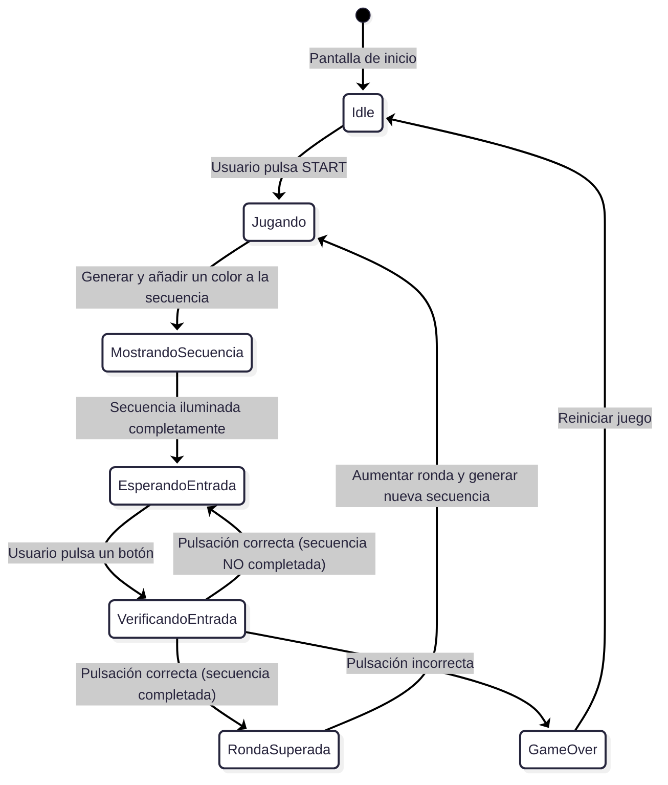
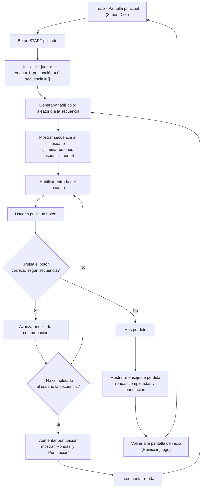

# SIMÓN DICE - PMDM 🦑🫧🪼


## DESCRIPCIÓN DEL PROYECTO 👀

- ***ESTE PROYECTO ES UNA IMPLEMENTACIÓN DEL JUEGO "SIMÓN DICE" PARA ANDROID, DESARROLLADO EN KOTLIN CON ARQUITECTURA MVVM. EL JUEGO CONSISTE EN MEMORIZAR Y REPETIR SECUENCIAS DE COLORES QUE SE VAN HACIENDO CADA VEZ MÁS LARGAS Y COMPLEJAS.***

> [!NOTE]
> **Antes de empezar a codificar el programa he realizado un diagrama de flujo y estado para comprender de manera profunda la lógica que va a seguir🤖...**

---

- **DIAGRAMA DE ESTADO 🎀**



---

- **DIAGRAMA DE FLUJO 🎳**



<br>

---

## ESTRUCTURA DEL PROYECTO 🏗️

> [!WARNING]
> ***LOS TESTS UNITARIOS ESTÁN EN `SIMON_DICE_SAUL\app\src\test\java\com\example\simon_dice_saul\presentation\viewmodel\ModeloVistaSimonTest.kt`***


### MODEL (MODELO DE DATOS Y DOMINIO) 🦕
- **ColorSimon: ENUM QUE REPRESENTA LOS COLORES DEL JUEGO**
  
```kotlin
// FASES DEL JUEGO
enum class EstadoJuego {
    INICIO, JUGANDO, MOSTRANDO_SECUENCIA, ESPERANDO_ENTRADA, 
    VERIFICANDO_ENTRADA, RONDA_SUPERADA, JUEGO_TERMINADO
}

// ENUM QUE REPRESENTA LOS 4 COLORES DEL JUEGO CON IDENTIFICADORES ÚNICOS
enum class ColorSimon(val identificador: Int) {
    ROJO(0), VERDE(1), AZUL(2), AMARILLO(3)
}
```

- **MotorJuegoSimon: CLASE QUE CONTIENE TODA LA LÓGICA DEL JUEGO, GESTIÓN DE SECUENCIAS, PUNTUACIÓN Y ESTADOS DEL JUEGO**
  
```kotlin
// CLASE QUE CONTIENE TODA LA LÓGICA DEL JUEGO
class MotorJuegoSimon {
    // MÉTODOS:
    // - iniciarPartida(): Reinicia el juego al estado inicial
    // - anadirColorAleatorio(): Añade nuevo color a la secuencia
    // - validarEntradaUsuario(): Comprueba si el input es correcto
    // - obtenerEstadoActual(): Devuelve estado inmutable del juego
}
```

---

### VIEW (INTERFAZ DE USUARIO) 🤹 

- **SimonDiceScreen: PANTALLA PRINCIPAL CON JETPACK COMPOSE**
- **INTERFAZ QUE OBSERVA LOS CAMBIOS DE ESTADO**
- **BOTONES DE COLORES Y ANIMACIONES**

```kotlin
@Composable
fun SimonDiceScreen(viewModel: ModeloVistaSimon) {
    // OBSERVA EL ESTADO DEL VIEWMODEL
    val uiState = viewModel.uiState.collectAsState().value
    
    // USA LaunchedEffect PARA EVENTOS DE UN SOLO USO ( PARA AÑADIR LAUNCHEFFECT AL PROYECTO PUSE UN PRINTLN COMO SI FUESE UN SONIDO DE ERROR ) 
    LaunchedEffect(viewModel.eventEffect) {
    }
    
    // COMPOSICIÓN DE UI CON COMPONENTES REUTILIZABLES
    Column {
        // Header con título y puntuación
        // Mensaje de estado del juego ( EL CUAL CONTIENE UNA ANIMACIÓN DE FLUIDEZ ( CAMBIA DE MANERA FLUIDA ENTRE "JUEGO TERMINADO", "OBSERVA LA SECUENCIA" Y "TU TURNO" )) 
        // Botones de control (Iniciar/Reiniciar)
        // Grid de colores con animaciones ( EFECTO REBOTE O ZOOM CUANDO SE MUESTRA LA SECUENCIA EN CADA BOTÓN )
    }
}
```


---

### VIEWMODEL (GESTIÓN DE ESTADO) 🦫 

- **ModeloVistaSimon: GESTIONA EL ESTADO DE LA UI Y COORDINA CON EL MOTOR DE JUEGO**
- **USO DE StateFlow PARA EL MANEJO DE ESTADOS**
- **MANEJO DE CORRUTINAS PARA ANIMACIONES Y LÓGICA**
  
```kotlin
class ModeloVistaSimon : ViewModel() {
    // ESTADO REACTIVO CON StateFlow
    private val _uiState = MutableStateFlow(UiState())
    val uiState: StateFlow<UiState> = _uiState.asStateFlow()
    
    // GESTIÓN DE EVENTOS DE UN SOLO USO
    private val _eventEffect = MutableStateFlow<EventEffect?>(null)
    val eventEffect: EventEffect? get() = _eventEffect.value
    
    // SEALED CLASS PARA ESTADOS DEL JUEGO
    sealed class GameState {
        object INICIO : GameState()
        object MOSTRANDO_SECUENCIA : GameState()
        object ESPERANDO_ENTRADA : GameState()
        object RONDA_SUPERADA : GameState()
        object ERROR : GameState()
    }
    
    // FUNCIONES:
    // - iniciarPartida(): Inicia nueva partida
    // - alPulsarColor(): Maneja input del usuario
    // - reiniciarJuego(): Reinicia desde pantalla de error
}
```

<br>

### COMO SE VE EL PROGRAMA AL EJECUTAR 👀

> [!NOTE]
> **AL SER CAPTURAS NO SE APRECIA EL EFECTO DE FLUIDEZ QUE AÑADÍ PARA LAS TRANSICCIONES DE TEXTO, SI SE EJECUTASE EL PROGRAMA, SE PODRÍA APRECIAR COMO "TU TURNO", "JUEGO TERMINADO", "OBSERVA LA SECUENCIA" SE INTERCAMBIAN EN EL MISMO LAYOUT CON UN EFECTO FLUIDO ( COMO DE MÁQUINA DE ESCRIBIR )**

---

> [!WARNING]
> **COMO SE VE LA INTERFAZ UNA VEZ ARRANCAS EL PROGRAMA**


> [!WARNING]
> **COMO SE VE LA INTERFAZ MIENTRAS OBSERVAS LA SECUENCIA**


> [!WARNING]
> **COMO SE VE LA INTERFAZ UNA VEZ CLICAS INICIAR**


> [!WARNING]
> **COMO SE VE LA INTERFAZ UNA VEZ FALLAS LA SECUENCIA**


### IMPLEMENTACIÓN ROOM 🦜

> ***Se migró el almacenamiento del récord desde SharedPreferences a una base de datos local con Room, manteniendo la funcionalidad y la experiencia de usuario.***

- Misma lógica de juego
- UI sin cambios
- Persistencia más robusta y escalable

> ***Se implmenetaron dependencias de ROOM ( room-runtime, room-compiler ), clase Record como @Entity, DAO del record para operaciones básicas ( get, insert, clear ), base de datos AppDatabase ( singleton implícito ), integración directa en ModeloVistaSimón y verificación en MainActivity***

---
# Simon Dice – Persistencia Triple con MongoDB Local

## 🗃️ Implementación de MongoDB (uso de GitHub Copilot)

Esta práctica añade una **tercera capa de persistencia** a la app *Simon Dice*, cumpliendo con el requisito:
> *"Guardar el récord en una base de datos MongoDB, además de mantener SharedPreferences y Room"*

Dado que **no se puede conectar directamente desde Android a MongoDB sin pagar**, se implementó una solución segura, realista y compatible con entornos académicos:

- ✅ **Room**: persistencia local principal (ya existente)
- ✅ **SharedPreferences**: compatibilidad legacy (sin uso activo)
- ✅ **MongoDB**: persistencia adicional en **máquina virtual local**, accesible mediante una **API REST intermedia**

---

## 🔧 Issues implementados

### Issue #1: Configurar MongoDB y API REST en máquina virtual
**Descripción**:  
Instalar MongoDB en VM, crear base de datos `simon_dice` y colección `records`. Desarrollar un servidor REST mínimo con Node.js (`server.js`) que reciba récords vía POST y los almacene en MongoDB. El servidor escucha en `http://IP_VM:3000`.

**Checklist**:
- [x] MongoDB instalado y ejecutándose en VM
- [x] Script `server.js` con Express y driver de MongoDB
- [x] Puerto 3000 abierto en firewall
- [x] Prueba manual de inserción exitosa

**Etiquetas**: `enhancement`, `database`, `mongodb`, `local`

---

### Issue #2: Añadir dependencias HTTP para Android
**Descripción**:  
Integrar **Ktor Client** en `app/build.gradle.kts` para permitir comunicación HTTP con la API REST local. Se usan módulos ligeros compatibles con Android.

**Checklist**:
- [x] Dependencias `ktor-client-core`, `ktor-client-cio`, `ktor-client-content-negotiation` añadidas
- [x] Proyecto compila sin errores
- [x] Serialización JSON configurada

**Etiquetas**: `enhancement`, `dependencies`, `http`

---

### Issue #3: Implementar `MongoApiRepository`
**Descripción**:  
Crear repositorio que envíe récords a `http://IP_VM:3000/record` usando Ktor. La clase maneja errores de red sin afectar la experiencia del usuario.

**Checklist**:
- [x] Clase `MongoApiRepository.kt` creada
- [x] Método `saveRecord()` con Coroutines
- [x] Manejo de excepciones robusto
- [x] IP de VM configurable

**Etiquetas**: `enhancement`, `repository`, `http`

---

### Issue #4: Integrar MongoDB en `ModeloVistaSimon`
**Descripción**:  
Modificar el ViewModel para que, al superar un récord, lo guarde en:
1. **Room** (principal)
2. **MongoDB** (vía API REST)

La operación es asíncrona y no bloquea la UI. Si falla la red, el juego sigue funcionando.

**Checklist**:
- [x] `MongoApiRepository` inyectado en ViewModel
- [x] Llamada en `viewModelScope.launch`
- [x] Sin impacto en lógica existente
- [x] Logs de depuración añadidos

**Etiquetas**: `enhancement`, `mvvm`, `integration`

---

### Issue #5: Documentar arquitectura triple
**Descripción**:  
Este README explica las tres capas de persistencia, la razón de usar una API REST intermedia, y cómo configurar el entorno local.

**Checklist**:
- [x] Explicación clara de la arquitectura
- [x] Instrucciones para configurar VM
- [x] Diagrama de flujo implícito
- [x] Sin credenciales expuestas

**Etiquetas**: `documentation`

---

## 📦 Arquitectura de persistencia

| Capa | Tecnología | Propósito |
|------|-----------|----------|
| Legacy | `SharedPreferences` | Compatibilidad (sin uso activo) |
| Principal | `Room` (SQLite) | Persistencia local robusta |
| Adicional | `MongoDB` (VM local) | Backup en base de datos NoSQL |

> 🔒 **Seguridad**: La app **nunca se conecta directamente a MongoDB**. Usa una API REST como intermediario, siguiendo buenas prácticas de desarrollo móvil.

---

## 🛠️ Configuración local (requerida para pruebas)

1. **En tu VM**:
    - Instalar MongoDB y asegurarte de que `mongod` esté corriendo
    - Ejecutar `node server.js` en la carpeta del proyecto
    - Abrir puerto `3000` en el firewall

2. **En tu app Android**:
    - Reemplazar `192.168.1.100` por la IP real de tu VM en:
        - `MongoApiRepository.kt`
        - `ModeloVistaSimon.kt`

3. **Prueba**:
    - Juega y supera tu récord
    - Verifica en MongoDB:
      ```bash
      mongo simon_dice --eval "db.records.find().pretty()"
      ```

---

## 💡 Notas finales

- Esta implementación **cumple el enunciado** sin requerir tarjeta de crédito ni servicios de pago.
- El uso de **GitHub Copilot** fue clave para:
    - Generar la estructura de issues
    - Proponer código inicial para el repositorio
    - Sugerir mensajes de commit convencionales
    - Ayudar en la redacción de documentación técnica
- Todo el código generado por IA fue **revisado, corregido y adaptado manualmente** para garantizar funcionalidad, seguridad y calidad.
