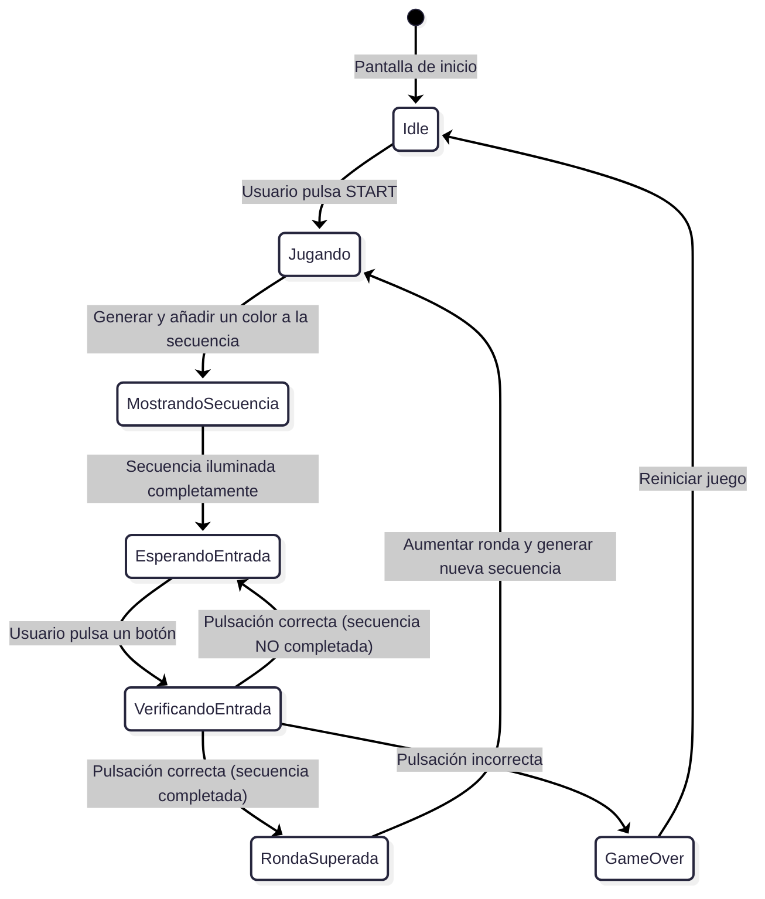
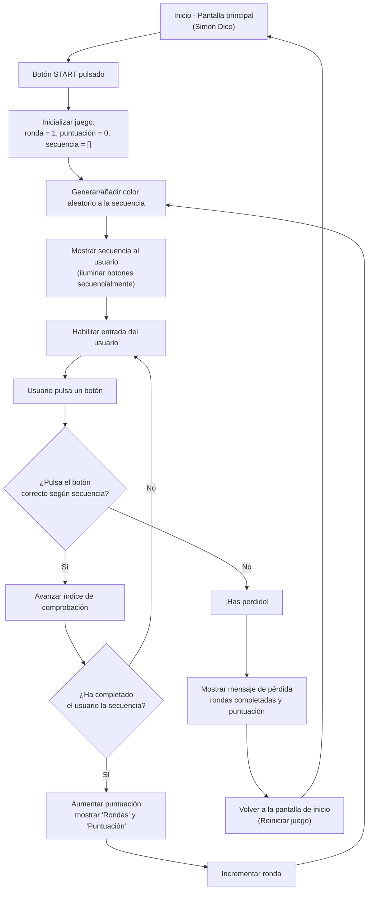

# SIMÓN DICE - PMDM 🦑🫧🪼


## DESCRIPCIÓN DEL PROYECTO 👀

- ***ESTE PROYECTO ES UNA IMPLEMENTACIÓN DEL JUEGO "SIMÓN DICE" PARA ANDROID, DESARROLLADO EN KOTLIN CON ARQUITECTURA MVVM. EL JUEGO CONSISTE EN MEMORIZAR Y REPETIR SECUENCIAS DE COLORES QUE SE VAN HACIENDO CADA VEZ MÁS LARGAS Y COMPLEJAS.***

> [!NOTE]
> **Antes de empezar a codificar el programa he realizado un diagrama de flujo y estado para comprender de manera profunda la lógica que va a seguir🤖...**

---

- **DIAGRAMA DE ESTADO 🎀**



---

- **DIAGRAMA DE FLUJO 🎳**



<br>

---

## ESTRUCTURA DEL PROYECTO 🏗️

> [!WARNING]
> ***LOS TESTS UNITARIOS ESTÁN EN `SIMON_DICE_SAUL\app\src\test\java\com\example\simon_dice_saul\presentation\viewmodel\ModeloVistaSimonTest.kt`***


### MODEL (MODELO DE DATOS Y DOMINIO) 🦕
- **ColorSimon: ENUM QUE REPRESENTA LOS COLORES DEL JUEGO**
  
```kotlin
// FASES DEL JUEGO
enum class EstadoJuego {
    INICIO, JUGANDO, MOSTRANDO_SECUENCIA, ESPERANDO_ENTRADA, 
    VERIFICANDO_ENTRADA, RONDA_SUPERADA, JUEGO_TERMINADO
}

// ENUM QUE REPRESENTA LOS 4 COLORES DEL JUEGO CON IDENTIFICADORES ÚNICOS
enum class ColorSimon(val identificador: Int) {
    ROJO(0), VERDE(1), AZUL(2), AMARILLO(3)
}
```

- **MotorJuegoSimon: CLASE QUE CONTIENE TODA LA LÓGICA DEL JUEGO, GESTIÓN DE SECUENCIAS, PUNTUACIÓN Y ESTADOS DEL JUEGO**
  
```kotlin
// CLASE QUE CONTIENE TODA LA LÓGICA DEL JUEGO
class MotorJuegoSimon {
    // MÉTODOS:
    // - iniciarPartida(): Reinicia el juego al estado inicial
    // - anadirColorAleatorio(): Añade nuevo color a la secuencia
    // - validarEntradaUsuario(): Comprueba si el input es correcto
    // - obtenerEstadoActual(): Devuelve estado inmutable del juego
}
```

---

### VIEW (INTERFAZ DE USUARIO) 🤹 

- **SimonDiceScreen: PANTALLA PRINCIPAL CON JETPACK COMPOSE**
- **INTERFAZ QUE OBSERVA LOS CAMBIOS DE ESTADO**
- **BOTONES DE COLORES Y ANIMACIONES**

```kotlin
@Composable
fun SimonDiceScreen(viewModel: ModeloVistaSimon) {
    // OBSERVA EL ESTADO DEL VIEWMODEL
    val uiState = viewModel.uiState.collectAsState().value
    
    // USA LaunchedEffect PARA EVENTOS DE UN SOLO USO ( PARA AÑADIR LAUNCHEFFECT AL PROYECTO PUSE UN PRINTLN COMO SI FUESE UN SONIDO DE ERROR ) 
    LaunchedEffect(viewModel.eventEffect) {
    }
    
    // COMPOSICIÓN DE UI CON COMPONENTES REUTILIZABLES
    Column {
        // Header con título y puntuación
        // Mensaje de estado del juego ( EL CUAL CONTIENE UNA ANIMACIÓN DE FLUIDEZ ( CAMBIA DE MANERA FLUIDA ENTRE "JUEGO TERMINADO", "OBSERVA LA SECUENCIA" Y "TU TURNO" )) 
        // Botones de control (Iniciar/Reiniciar)
        // Grid de colores con animaciones ( EFECTO REBOTE O ZOOM CUANDO SE MUESTRA LA SECUENCIA EN CADA BOTÓN )
    }
}
```


---

### VIEWMODEL (GESTIÓN DE ESTADO) 🦫 

- **ModeloVistaSimon: GESTIONA EL ESTADO DE LA UI Y COORDINA CON EL MOTOR DE JUEGO**
- **USO DE StateFlow PARA EL MANEJO DE ESTADOS**
- **MANEJO DE CORRUTINAS PARA ANIMACIONES Y LÓGICA**
  
```kotlin
class ModeloVistaSimon : ViewModel() {
    // ESTADO REACTIVO CON StateFlow
    private val _uiState = MutableStateFlow(UiState())
    val uiState: StateFlow<UiState> = _uiState.asStateFlow()
    
    // GESTIÓN DE EVENTOS DE UN SOLO USO
    private val _eventEffect = MutableStateFlow<EventEffect?>(null)
    val eventEffect: EventEffect? get() = _eventEffect.value
    
    // SEALED CLASS PARA ESTADOS DEL JUEGO
    sealed class GameState {
        object INICIO : GameState()
        object MOSTRANDO_SECUENCIA : GameState()
        object ESPERANDO_ENTRADA : GameState()
        object RONDA_SUPERADA : GameState()
        object ERROR : GameState()
    }
    
    // FUNCIONES:
    // - iniciarPartida(): Inicia nueva partida
    // - alPulsarColor(): Maneja input del usuario
    // - reiniciarJuego(): Reinicia desde pantalla de error
}
```

<br>

### COMO SE VE EL PROGRAMA AL EJECUTAR 👀

> [!NOTE]
> **AL SER CAPTURAS NO SE APRECIA EL EFECTO DE FLUIDEZ QUE AÑADÍ PARA LAS TRANSICCIONES DE TEXTO, SI SE EJECUTASE EL PROGRAMA, SE PODRÍA APRECIAR COMO "TU TURNO", "JUEGO TERMINADO", "OBSERVA LA SECUENCIA" SE INTERCAMBIAN EN EL MISMO LAYOUT CON UN EFECTO FLUIDO ( COMO DE MÁQUINA DE ESCRIBIR )**

---

> [!WARNING]
> **COMO SE VE LA INTERFAZ UNA VEZ ARRANCAS EL PROGRAMA**


> [!WARNING]
> **COMO SE VE LA INTERFAZ MIENTRAS OBSERVAS LA SECUENCIA**


> [!WARNING]
> **COMO SE VE LA INTERFAZ UNA VEZ CLICAS INICIAR**


> [!WARNING]
> **COMO SE VE LA INTERFAZ UNA VEZ FALLAS LA SECUENCIA**


### IMPLEMENTACIÓN ROOM 🦜

> ***Se migró el almacenamiento del récord desde SharedPreferences a una base de datos local con Room, manteniendo la funcionalidad y la experiencia de usuario.***

- Misma lógica de juego
- UI sin cambios
- Persistencia más robusta y escalable

> ***Se implmenetaron dependencias de ROOM ( room-runtime, room-compiler ), clase Record como @Entity, DAO del record para operaciones básicas ( get, insert, clear ), base de datos AppDatabase ( singleton implícito ), integración directa en ModeloVistaSimón y verificación en MainActivity***

---

### IMPLMENTACIÓN MONGODB (USO DE COPILOT) 🦢

### Issue #1: Configurar cuenta y base de datos en MongoDB Atlas
**Descripción**:
Crear una cuenta gratuita en [MongoDB Atlas](https://www.mongodb.com/atlas), crear un proyecto llamado `simon_dice`, una base de datos `simon_dice`, y una colección `records`. Habilitar acceso desde cualquier IP (0.0.0.0/0) para desarrollo y crear un usuario con contraseña. Guardar la cadena de conexión y el App ID en `local.properties` (no commitear credenciales).

**Checklist**:
- [ ] Cuenta de MongoDB Atlas creada
- [ ] Proyecto `simon_dice` creado
- [ ] Base de datos `simon_dice` con colección `records` configurada
- [ ] Usuario con permisos de lectura/escritura creado
- [ ] Cadena de conexión y App ID guardados de forma segura

**Etiquetas**: `enhancement`, `database`, `mongodb`, `setup`

---

### Issue #2: Añadir dependencias de MongoDB Realm al proyecto
**Descripción**:
Integrar el SDK de MongoDB Realm Kotlin (`io.realm.kotlin:library-sync`) en `app/build.gradle.kts`. Configurar el plugin de Realm y asegurar que sea compatible con la versión de Kotlin usada en el proyecto (1.9+). Verificar compilación sin errores.

**Checklist**:
- [ ] Dependencia `io.realm.kotlin:library-sync` añadida
- [ ] Plugin `io.realm.kotlin` configurado
- [ ] Proyecto compila sin errores
- [ ] Sincronización de Gradle completada

**Etiquetas**: `enhancement`, `dependencies`, `mongodb`

---

### Issue #3: Crear modelo `MongoRecord` compatible con Realm
**Descripción**:
Definir una clase `MongoRecord` anotada con `@RealmModel` que contenga los campos `rondaMasAlta: Int` y `fecha: String`. Asegurar compatibilidad con el modelo existente `Record` de Room. Ubicar en `data/model/MongoRecord.kt`.

**Checklist**:
- [ ] Clase `MongoRecord` creada con anotación `@RealmModel`
- [ ] Campos `rondaMasAlta` y `fecha` definidos
- [ ] Compatible con serialización JSON
- [ ] Sin conflictos de nombres con `Record` existente

**Etiquetas**: `enhancement`, `model`, `mongodb`

---

### Issue #4: Implementar `MongoRepository` para operaciones CRUD
**Descripción**:
Crear `MongoRepository` usando MongoDB Realm Kotlin SDK con Coroutines. Implementar métodos:
- `insertRecord(record: MongoRecord)`: Inserta un nuevo récord
- `getHighestRecord(): MongoRecord?`: Obtiene el récord más alto
- `getAllRecords(): List<MongoRecord>`: Lista todos los récords
- `deleteAllRecords()`: Limpia la colección

Manejar excepciones y estados de sincronización de forma reactiva.

**Checklist**:
- [ ] `MongoRepository` creado en `data/repository/`
- [ ] Métodos CRUD implementados con Coroutines
- [ ] Manejo robusto de excepciones
- [ ] Sincronización con Realm Sync configurada
- [ ] Pruebas unitarias básicas

**Etiquetas**: `enhancement`, `repository`, `mongodb`

---

### Issue #5: Integrar MongoDB en `ModeloVistaSimon`
**Descripción**:
Modificar `ModeloVistaSimon` para que al actualizar el récord, lo guarde simultáneamente en:
1. SharedPreferences (compatibilidad legacy)
2. Room (almacenamiento local)
3. MongoDB (remoto mediante MongoRepository)

Usar `viewModelScope.launch` con Coroutines. No eliminar lógica existente; solo añadir capas nuevas. Manejar fallos de MongoDB sin afectar la experiencia local.

**Checklist**:
- [ ] `MongoRepository` inyectado en `ModeloVistaSimon`
- [ ] Método `actualizarRecordEnTodasLasCap()`as creado
- [ ] Sincronización en paralelo (SharedPrefs + Room + MongoDB)
- [ ] Fallos de MongoDB no bloquean la app
- [ ] Logs de sincronización añadidos

**Etiquetas**: `enhancement`, `mvvm`, `mongodb`, `integration`

---

### Issue #6: Documentar la arquitectura de persistencia triple
**Descripción**:
Actualizar `README.md` con secciones:
- **Arquitectura de Persistencia**: Explicar por qué coexisten SharedPreferences, Room y MongoDB
- **Configuración de MongoDB**: Pasos para obtener credenciales en `local.properties`
- **Sincronización de Datos**: Diagrama o descripción del flujo
- **Seguridad**: Cómo se protegen las credenciales

Incluir ejemplos de código y referencias a la documentación oficial.

**Checklist**:
- [ ] Sección de arquitectura añadida
- [ ] Instrucciones de configuración claras
- [ ] Diagrama de flujo (ASCII o imagen)
- [ ] Ejemplos de código documentados
- [ ] Sin credenciales expuestas

**Etiquetas**: `documentation`, `mongodb`

---

### Issue #7: Configurar autenticación anónima de MongoDB Realm
**Descripción**:
Habilitar la autenticación anónima en MongoDB Atlas Console. Crear un `RealmConfiguration` en la app que use credenciales desde `local.properties`. Inicializar `Realm.open()` con sincronización automática antes de usar `MongoRepository`.

**Checklist**:
- [ ] Autenticación anónima habilitada en MongoDB
- [ ] `RealmConfiguration` creado en `App.kt` o similar
- [ ] Variables de entorno leídas correctamente
- [ ] Conexión de prueba exitosa
- [ ] Manejo de desconexiones y reconexiones

**Etiquetas**: `enhancement`, `security`, `mongodb`

---

### Issue #8: Crear tests para `MongoRepository`
**Descripción**:
Escribir tests unitarios usando JUnit y MockK para validar:
- Inserción correcta de registros
- Recuperación del récord más alto
- Manejo de errores de conexión
- Sincronización de datos

Usar Emulador de Realm o mocks para no depender de MongoDB real en CI/CD.

**Checklist**:
- [ ] Tests para `insertRecord()` creados
- [ ] Tests para `getHighestRecord()` creados
- [ ] Tests de manejo de errores
- [ ] Cobertura mínima del 80%
- [ ] CI/CD configurado

**Etiquetas**: `enhancement`, `testing`, `mongodb`
