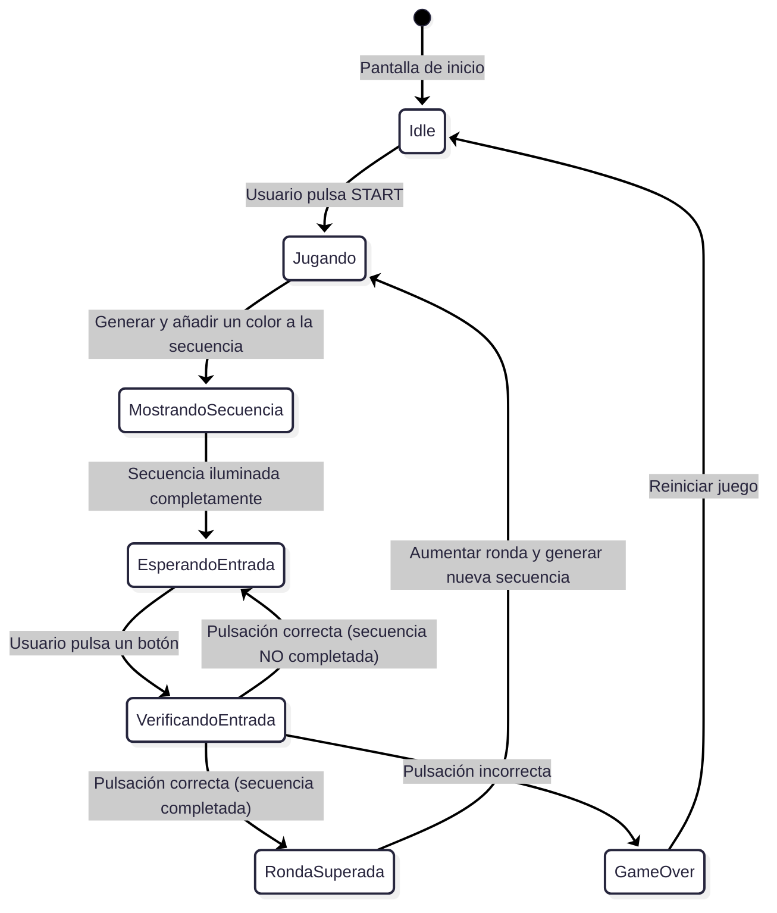
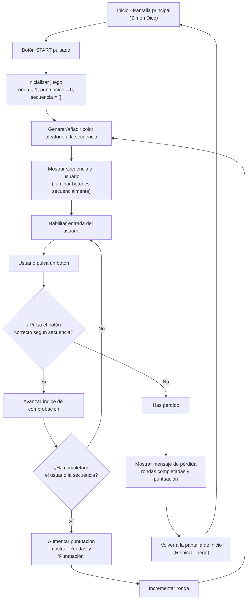

# SIMÓN DICE - PMDM 🦑🫧🪼

## DESCRIPCIÓN DEL PROYECTO 👀

- ESTE PROYECTO ES UNA IMPLEMENTACIÓN DEL JUEGO CLÁSICO "SIMÓN DICE" PARA ANDROID, DESARROLLADO EN KOTLIN CON ARQUITECTURA MVVM. EL JUEGO CONSISTE EN MEMORIZAR Y REPETIR SECUENCIAS DE COLORES QUE SE VAN HACIENDO CADA VEZ MÁS LARGAS Y COMPLEJAS.

> **Antes de empezar a codificar el programa he realizado un diagrama de flujo y estado para comprender de manera profunda la lógica que va a seguir🤖...**

---

- **DIAGRAMA DE ESTADO 🎀**

---

- **DIAGRAMA DE FLUJO 🎳**

---

## CARACTERÍSTICAS PRINCIPALES DEL PROYECTO 🪽

- **INTERFAZ MODERNA DESARROLLADA CON JETPACK COMPOSE**
- **ARQUITECTURA MVVM PARA SEPARACIÓN CLARA DE RESPONSABILIDADES**
- **GESTIÓN DE ESTADO REACTIVA CON FLOWS**
- **TESTING COMPLETO CON CORRUTINAS**
- **ANIMACIONES Y FEEDBACK VISUAL**

---

## ESTRUCTURA DEL PROYECTO 🏗️

### MODEL (MODELO DE DATOS Y DOMINIO) 🦕
- **ColorSimon: ENUM QUE REPRESENTA LOS COLORES DEL JUEGO**
- **MotorJuegoSimon: CLASE QUE CONTIENE TODA LA LÓGICA DEL JUEGO**
- **GESTIÓN DE SECUENCIAS, PUNTUACIÓN Y ESTADOS DEL JUEGO**

---

### VIEW (INTERFAZ DE USUARIO) 🤹
- **SimonDiceScreen: PANTALLA PRINCIPAL CON JETPACK COMPOSE**
- **INTERFAZ REACTIVA QUE OBSERVA LOS CAMBIOS DE ESTADO**
- **BOTONES DE COLORES Y ANIMACIONES**

---

### VIEWMODEL (GESTIÓN DE ESTADO) 🦫
- **ModeloVistaSimon: GESTIONA EL ESTADO DE LA UI Y COORDINA CON EL DOMINIO**
- **USO DE StateFlow PARA ESTADO REACTIVO**
- **MANEJO DE CORRUTINAS PARA ANIMACIONES Y LÓGICA TEMPORAL**

