# SIMÓN DICE - PMDM 🦑🫧🪼

> **Antes de empezar a codificar el programa hemos realizado un diagrama de flujo y estado para comprender de manera profunda la lógica 🤖...**

---

- **DIAGRAMA DE ESTADO 🎀**

```mermaid

---
config:
  theme: redux
  look: neo
---
stateDiagram-v2
    [*] --> Idle : Pantalla de inicio
    state Idle : Aplicación abierta / Pantalla de inicio
    
    Idle --> Jugando : Usuario pulsa START
    state Jugando : Estado principal del juego

    Jugando --> MostrandoSecuencia : Generar y añadir un color a la secuencia
    state MostrandoSecuencia : Iluminar secuencia generada

    MostrandoSecuencia --> EsperandoEntrada : Secuencia iluminada completamente
    state EsperandoEntrada : Esperando pulsaciones del usuario

    EsperandoEntrada --> VerificandoEntrada : Usuario pulsa un botón
    state VerificandoEntrada : Comprobando pulsación

    VerificandoEntrada --> EsperandoEntrada : Pulsación correcta (secuencia NO completada)
    VerificandoEntrada --> RondaSuperada : Pulsación correcta (secuencia completada)
    VerificandoEntrada --> GameOver : Pulsación incorrecta

    state RondaSuperada : El usuario completó la secuencia correctamente
    RondaSuperada --> Jugando : Aumentar ronda y generar nueva secuencia

    state GameOver : Mostrar mensaje de pérdida
    GameOver --> Idle : Reiniciar juego

```

---

- **DIAGRAMA DE FLUJO 🎳**

```mermaid
flowchart TD
  A["Inicio - Pantalla principal<br/>(Simon Dice)"] --> B["Botón START pulsado"]
  B --> C["Inicializar juego:<br/>ronda = 1, puntuación = 0, secuencia = []"]
  C --> D["Generar/añadir color aleatorio a la secuencia"]
  D --> E["Mostrar secuencia al usuario<br/>(iluminar botones secuencialmente)"]
  E --> F["Habilitar entrada del usuario"]
  F --> G["Usuario pulsa un botón"]

  G --> H{"¿Pulsa el botón<br/>correcto según secuencia?"}
  H -->|"Sí"| I["Avanzar índice de comprobación"]
  I --> J{"¿Ha completado<br/>el usuario la secuencia?"}
  J -->|"No"| F
  J -->|"Sí"| K["Aumentar puntuación<br/>mostrar 'Rondas' y 'Puntuación'"]
  K --> L["Incrementar ronda"]
  L --> D

  H -->|"No"| M["¡Has perdido!"]
  M --> N["Mostrar mensaje de pérdida<br/>rondas completadas y puntuación"]
  N --> O["Volver a la pantalla de inicio<br/>(Reiniciar juego)"]
  O --> A

  A ~~~ D

```

