# SIMÓN DICE - PMDM 🦑🫧🪼


## DESCRIPCIÓN DEL PROYECTO 👀

- ***ESTE PROYECTO ES UNA IMPLEMENTACIÓN DEL JUEGO "SIMÓN DICE" PARA ANDROID, DESARROLLADO EN KOTLIN CON ARQUITECTURA MVVM. EL JUEGO CONSISTE EN MEMORIZAR Y REPETIR SECUENCIAS DE COLORES QUE SE VAN HACIENDO CADA VEZ MÁS LARGAS Y COMPLEJAS.***

> [!NOTE]
> **Antes de empezar a codificar el programa he realizado un diagrama de flujo y estado para comprender de manera profunda la lógica que va a seguir🤖...**

---

- **DIAGRAMA DE ESTADO 🎀**

```mermaid

---
config:
  theme: redux
  look: neo
---
stateDiagram-v2
    [*] --> Idle : Pantalla de inicio
    state Idle : Aplicación abierta / Pantalla de inicio
    
    Idle --> Jugando : Usuario pulsa START
    state Jugando : Estado principal del juego

    Jugando --> MostrandoSecuencia : Generar y añadir un color a la secuencia
    state MostrandoSecuencia : Iluminar secuencia generada

    MostrandoSecuencia --> EsperandoEntrada : Secuencia iluminada completamente
    state EsperandoEntrada : Esperando pulsaciones del usuario

    EsperandoEntrada --> VerificandoEntrada : Usuario pulsa un botón
    state VerificandoEntrada : Comprobando pulsación

    VerificandoEntrada --> EsperandoEntrada : Pulsación correcta (secuencia NO completada)
    VerificandoEntrada --> RondaSuperada : Pulsación correcta (secuencia completada)
    VerificandoEntrada --> GameOver : Pulsación incorrecta

    state RondaSuperada : El usuario completó la secuencia correctamente
    RondaSuperada --> Jugando : Aumentar ronda y generar nueva secuencia

    state GameOver : Mostrar mensaje de pérdida
    GameOver --> Idle : Reiniciar juego

```



---

- **DIAGRAMA DE FLUJO 🎳**

```mermaid
flowchart TD
  A["Inicio - Pantalla principal<br/>(Simon Dice)"] --> B["Botón START pulsado"]
  B --> C["Inicializar juego:<br/>ronda = 1, puntuación = 0, secuencia = []"]
  C --> D["Generar/añadir color aleatorio a la secuencia"]
  D --> E["Mostrar secuencia al usuario<br/>(iluminar botones secuencialmente)"]
  E --> F["Habilitar entrada del usuario"]
  F --> G["Usuario pulsa un botón"]

  G --> H{"¿Pulsa el botón<br/>correcto según secuencia?"}
  H -->|"Sí"| I["Avanzar índice de comprobación"]
  I --> J{"¿Ha completado<br/>el usuario la secuencia?"}
  J -->|"No"| F
  J -->|"Sí"| K["Aumentar puntuación<br/>mostrar 'Rondas' y 'Puntuación'"]
  K --> L["Incrementar ronda"]
  L --> D

  H -->|"No"| M["¡Has perdido!"]
  M --> N["Mostrar mensaje de pérdida<br/>rondas completadas y puntuación"]
  N --> O["Volver a la pantalla de inicio<br/>(Reiniciar juego)"]
  O --> A

  A ~~~ D

```



<br>

---

## ESTRUCTURA DEL PROYECTO 🏗️


### MODEL (MODELO DE DATOS Y DOMINIO) 🦕
- **ColorSimon: ENUM QUE REPRESENTA LOS COLORES DEL JUEGO**
  
```kotlin
// FASES DEL JUEGO
enum class EstadoJuego {
    INICIO, JUGANDO, MOSTRANDO_SECUENCIA, ESPERANDO_ENTRADA, 
    VERIFICANDO_ENTRADA, RONDA_SUPERADA, JUEGO_TERMINADO
}

// ENUM QUE REPRESENTA LOS 4 COLORES DEL JUEGO CON IDENTIFICADORES ÚNICOS
enum class ColorSimon(val identificador: Int) {
    ROJO(0), VERDE(1), AZUL(2), AMARILLO(3)
}
```

- **MotorJuegoSimon: CLASE QUE CONTIENE TODA LA LÓGICA DEL JUEGO, GESTIÓN DE SECUENCIAS, PUNTUACIÓN Y ESTADOS DEL JUEGO**
  
```kotlin
// CLASE QUE CONTIENE TODA LA LÓGICA DEL JUEGO
class MotorJuegoSimon {
    // MÉTODOS:
    // - iniciarPartida(): Reinicia el juego al estado inicial
    // - anadirColorAleatorio(): Añade nuevo color a la secuencia
    // - validarEntradaUsuario(): Comprueba si el input es correcto
    // - obtenerEstadoActual(): Devuelve estado inmutable del juego
}
```

---

### VIEW (INTERFAZ DE USUARIO) 🤹 

- **SimonDiceScreen: PANTALLA PRINCIPAL CON JETPACK COMPOSE**
- **INTERFAZ QUE OBSERVA LOS CAMBIOS DE ESTADO**
- **BOTONES DE COLORES Y ANIMACIONES**

```kotlin
@Composable
fun SimonDiceScreen(viewModel: ModeloVistaSimon) {
    // OBSERVA EL ESTADO DEL VIEWMODEL
    val uiState = viewModel.uiState.collectAsState().value
    
    // USA LaunchedEffect PARA EVENTOS DE UN SOLO USO ( PARA AÑADIR LAUNCHEFFECT AL PROYECTO PUSE UN PRINTLN COMO SI FUESE UN SONIDO DE ERROR ) 
    LaunchedEffect(viewModel.eventEffect) {
    }
    
    // COMPOSICIÓN DE UI CON COMPONENTES REUTILIZABLES
    Column {
        // Header con título y puntuación
        // Mensaje de estado del juego ( EL CUAL CONTIENE UNA ANIMACIÓN DE FLUIDEZ ( CAMBIA DE MANERA FLUIDA ENTRE "JUEGO TERMINADO", "OBSERVA LA SECUENCIA" Y "TU TURNO" )) 
        // Botones de control (Iniciar/Reiniciar)
        // Grid de colores con animaciones ( EFECTO REBOTE O ZOOM CUANDO SE MUESTRA LA SECUENCIA EN CADA BOTÓN )
    }
}
```


---

### VIEWMODEL (GESTIÓN DE ESTADO) 🦫 

- **ModeloVistaSimon: GESTIONA EL ESTADO DE LA UI Y COORDINA CON EL MOTOR DE JUEGO**
- **USO DE StateFlow PARA EL MANEJO DE ESTADOS**
- **MANEJO DE CORRUTINAS PARA ANIMACIONES Y LÓGICA**
  
```kotlin
class ModeloVistaSimon : ViewModel() {
    // ESTADO REACTIVO CON StateFlow
    private val _uiState = MutableStateFlow(UiState())
    val uiState: StateFlow<UiState> = _uiState.asStateFlow()
    
    // GESTIÓN DE EVENTOS DE UN SOLO USO
    private val _eventEffect = MutableStateFlow<EventEffect?>(null)
    val eventEffect: EventEffect? get() = _eventEffect.value
    
    // SEALED CLASS PARA ESTADOS DEL JUEGO
    sealed class GameState {
        object INICIO : GameState()
        object MOSTRANDO_SECUENCIA : GameState()
        object ESPERANDO_ENTRADA : GameState()
        object RONDA_SUPERADA : GameState()
        object ERROR : GameState()
    }
    
    // FUNCIONES:
    // - iniciarPartida(): Inicia nueva partida
    // - alPulsarColor(): Maneja input del usuario
    // - reiniciarJuego(): Reinicia desde pantalla de error
}
```

<br>

### COMO SE VE EL PROGRAMA AL EJECUTAR 👀


